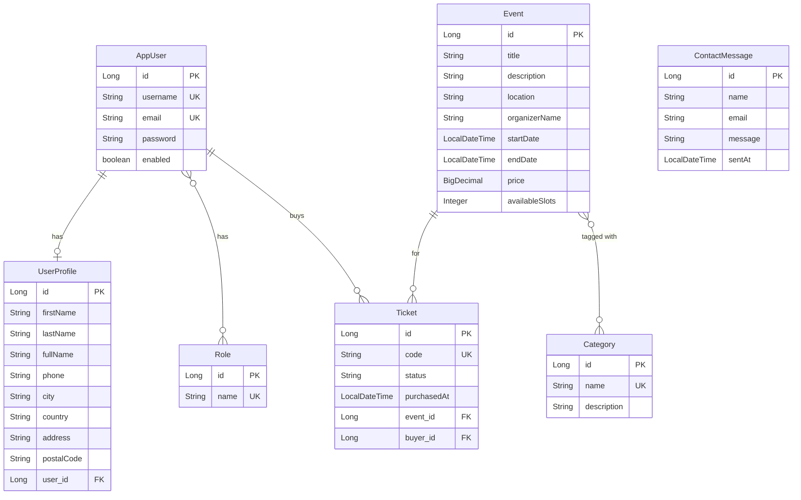

# Spring Events Portal

Welcome to the **Spring Events Portal**! This project is a robust, full-stack application featuring a monolithic **Spring Boot 3** backend and a dynamic **React** frontend. It serves as a comprehensive platform for organizers to create, manage, and monitor events, and for users to discover, register, and receive ticket confirmation emails.

---

## 🚀 Features

- **Modern Backend Architecture**: Built on Spring Boot 3 utilizing Spring Data JPA, Spring Security with JWT Authentication, and a clean layered architecture.
- **Interactive React Frontend**: A rich, responsive UI built with React and PrimeReact components.
- **Relational Data Management**: Handled via MySQL (for dev/prod) with fully structured JPA Entities.
- **Auto-Redirects & Toasts**: Registration screens automatically notify users of success and navigate back to Home after 5 seconds.
- **Contact Request Logging**: Saves user contact messages in the database.
- **Role-Based Authorization**: Event/category mutations and participant views are restricted to the `ORGANIZER` role at the endpoint level (Spring Security `hasRole`), enforced server-side via the JWT authorities filter.
- **BCrypt Password Hashing**: New accounts are stored with a Spring `DelegatingPasswordEncoder` (`{bcrypt}$2a$…`); logins verify via `PasswordEncoder.matches`. Passwords are also write-only in the API (never serialized back).
- **Pagination & Sorting**: Server-side `Pageable` for Events, Tickets and Categories, surfaced in the UI as the **Browse Events** section of the **Events** page (`/userEvents`) with page navigation, configurable page size, and column sorting.
- **Custom Error Pages**: A styled 404/500 page on both the backend (`CustomErrorController`) and the React SPA (catch-all `NotFound` route + `ErrorBoundary`).

---

## 📊 Database Entity-Relationship (E/R) Diagram

The system's database architecture is designed to efficiently manage users, events, categorizations, and ticket bookings. Below is the E/R diagram representing the schema.



### 📋 E/R Diagram Explanation

The database consists of the following primary entities:

1. **`AppUser` & `UserProfile` (One-to-One)**
   - `AppUser` handles core authentication data (email, password, enabled status).
   - `UserProfile` stores extended personal details (full name, phone, city). They share a strict **One-to-One** relationship, keeping authentication logic cleanly separated from personal profile data.
2. **`AppUser` & `Role` (Many-to-Many)**
   - An `AppUser` can possess multiple roles (e.g., `USER`, `ORGANIZER`), managed through the `user_roles` join table. This dictates what permissions they have in the system.
3. **`Event` & `Category` (Many-to-Many)**
   - `Event` represents an activity occurring at a specific `location` during a set timeframe.
   - Events can belong to multiple categories (e.g., a "Tech Festival" is tagged as both `Technology` and `Music`). This relationship is resolved via the `event_categories` join table.
4. **`Ticket` (Many-to-One)**
   - The `Ticket` entity bridges users and events. It acts as a **Many-to-One** relationship towards `AppUser` (the buyer) and a **Many-to-One** relationship towards `Event`.
5. **`ContactMessage` (Standalone)**
   - Persists contact forms submitted by guests, capturing `name`, `email`, and `message` alongside a timestamp.

---

## 🏛️ System Architecture

The application is structured as a **Client-Server Monolithic Architecture** with decoupled runtime layers:

```
                  +-----------------------------------+
                  |        React Frontend UI          |
                  |     (Vite + PrimeReact + CSS)     |
                  +-----------------+-----------------+
                                    |
                                    | HTTP REST Requests (JSON + JWT)
                                    v
                  +-----------------------------------+
                  |       Spring Security Filter      |
                  |     (JwtAuthFilter + Header)      |
                  +-----------------+-----------------+
                                    |
                                    v
                  +-----------------------------------+
                  |         Controller Layer          |
                  |  (Auth, Event, Contact Controllers)  |
                  +-----------------+-----------------+
                                    |
                                    v
                  +-----------------------------------+
                  |          Service Layer            |
                  |      (Core Business Logic)        |
                  +-----------------+-----------------+
                                    |
                                    v
                  +-----------------------------------+
                  |         Repository Layer          |
                  |      (Spring Data JPA / ORM)      |
                  +-----------------+-----------------+
                                    |
                   +----------------+----------------+
                   |                                 |
                   v (dev/prod profile)              v (test profile)
        +--------------------+             +--------------------+
        |   MySQL Database   |             |   H2 In-Memory     |
        +--------------------+             +--------------------+
```

- **Frontend (React 18 & Vite)**: Built using **PrimeReact** components for UI excellence. Manages app state locally and communicates asynchronously with the backend. Store JWT tokens securely for session maintenance.
- **Security & Authorization**: Uses **Spring Security 6** with a stateless JWT-based custom filter. Access is dynamically controlled; registration endpoints, public listings, and contact queries are permit-all, while ticket booking and event operations require token authentication.
- **Backend Layers**:
  - **Controllers**: Expose RESTful API resource endpoints (both standard `/api/**` and legacy dashboard `/events/**` routes).
  - **Services**: Abstract business validations, mailing dispatches, and transactional context.
  - **Repositories**: Standardize DB interactions using JPA interfaces.
- **Database Profiles**:
  - **`dev` profile**: Connects to a persistent MySQL database instance.
  - **`test` profile**: Boots an in-memory **H2 database** to run JUnit test suites quickly without external dependencies.

---

## 🛠️ Setup & Installation

### 1. Prerequisites
- **Java JDK 17** or higher
- **Maven** (or use the provided `mvnw` wrapper)
- **Node.js (v18+)** and **npm**
- **MySQL Server** (running locally on port 3306)

### 2. Environment Variables & Secret Configuration
The application externalizes sensitive values using environment variables. You must set these variables or configure default values before starting the backend:
- `organizer.invite-code` (Default: `ABC321`): The code required for organizers to register. Can be set as `ORGANIZER_INVITE_CODE`.

### 3. Database Setup (MySQL)
1. Open your MySQL command line or editor and create the database:
   ```sql
   CREATE DATABASE events_portal;
   ```
2. (Optional) Update your MySQL credentials (if they differ from root/no-password) in:
   `server/src/main/resources/application-dev.yml`

### 4. Running the Backend
Navigate to the `server` directory and start the Spring Boot application:
```bash
cd server
.\mvnw.cmd spring-boot:run
```
The server will start on **`http://localhost:8000`**.

### 5. Running the Frontend
Navigate to the `client` directory, install package dependencies, and launch the Vite server:
```bash
cd client
npm install
npm run dev
```
The frontend UI will run at **`http://localhost:5173`**.

### 6. Running Automated Tests
To run all JUnit tests and produce a code coverage report:
```bash
cd server
.\mvnw.cmd clean test
```
The test suite utilizes the H2 in-memory database and outputs a JaCoCo coverage report at `server/target/site/jacoco/index.html`.

---

## 📖 API Documentation

### 📄 Paginated & Sortable REST Endpoints
These return a Spring Data `Page` (`{ content, totalElements, totalPages, number, size, ... }`) and accept standard paging/sorting query params.

* **`GET /api/events`** *(public)* - paginated events. Params: `page`, `size`, `sort` (e.g. `?page=0&size=5&sort=startDate,asc`). Sortable by `startDate`, `price`, `title`, etc.
* **`GET /api/categories`** *(public)* - paginated categories (`?page=0&size=10&sort=name,asc`).
* **`GET /api/tickets`** *(authenticated)* - paginated tickets (`?page=0&size=10&sort=purchasedAt,desc`).
* **Writes** (`POST`/`PUT`/`DELETE` on `/api/events`, `/api/categories`, and legacy `/events`) and **`GET /events/participants`** require an `ORGANIZER` JWT; unauthenticated → `401`, authenticated non-organizer → `403`.

The **Events** page (`/userEvents`) includes a **Browse Events** section that consumes `GET /api/events` with a PrimeReact `DataTable` in lazy mode, exposing page navigation, a rows-per-page selector (5/10/20), and sortable columns.

### 🔒 Authentication Endpoints
* **`POST /userRegister`**
  * **Description**: Registers a standard attendee.
  * **Request Body**:
    ```json
    {
      "email": "user@example.com",
      "password": "password123",
      "first_name": "John",
      "last_name": "Doe",
      "phone_number": "0722222222",
      "city": "Bucharest"
    }
    ```
  * **Response (201)**: Returns authentication token and user JSON.

* **`POST /organizerRegister`**
  * **Description**: Registers an event organizer. Requires a valid invite code.
  * **Request Body**:
    ```json
    {
      "email": "org@example.com",
      "password": "password123",
      "first_name": "Jane",
      "last_name": "Doe",
      "phone_number": "0733333333",
      "city": "Cluj",
      "invite_code": "ABC321"
    }
    ```

* **`POST /userLogin`** / **`POST /organizerLogin`**
  * **Description**: Authenticates users and returns a JWT token.
  * **Request Body**:
    ```json
    {
      "email": "user@example.com",
      "password": "password123"
    }
    ```

---

### 📅 Event Management Endpoints
* **`GET /events`**
  * **Description**: Retrieves all events grouped by categories (for home views).
* **`GET /events/list`**
  * **Description**: Returns a flat list of all events with raw datetime values (for dropdown editing).
* **`POST /events`**
  * **Description**: Creates a new event. (Organizer only)
  * **Request Body**:
    ```json
    {
      "name": "Summer Tech Summit",
      "description": "Tech conference",
      "location": "Romexpo",
      "startDate": "2026-07-10T09:00:00",
      "endDate": "2026-07-12T17:00:00",
      "price": 99.99,
      "capacity": 500,
      "organizerName": "IT Agency"
    }
    ```
* **`PUT /events`**
  * **Description**: Edits an existing event. (Organizer only)
* **`DELETE /events`**
  * **Description**: Deletes an event and cleans up associated ticket entries. (Organizer only)
* **`POST /events/register`**
  * **Description**: Book a ticket for an event. (Authenticated user only)
  * **Request Body**:
    ```json
    {
      "event_id": 1
    }
    ```

---

### ✉️ Contact Endpoints
* **`POST /contactRequest`**
  * **Description**: Submits a contact query. Saves message data to the database.
  * **Request Body**:
    ```json
    {
      "name": "Alice Smith",
      "email": "alice@example.com",
      "message": "Hello, I have a question about event tickets."
    }
    ```

---

## 👥 Team Member Contributions

This project was developed by the following team members with a balanced, equal contribution across both the backend and frontend systems:

### Prelipceanu Alexandru
- **Backend - Authentication & JWT Security**: Configured the stateless Spring Security 6 pipeline and the custom `JwtAuthFilter`. Programmed the authentication REST controllers (`/userLogin`, `/organizerLogin`) and set up secure token-based user contexts.
- **Backend - Auth Controllers & DTOs**: Developed registration controllers (`/userRegister`, `/organizerRegister`), defined strict request DTO validation inputs, and handled invite code validation environment parameters.
- **Frontend - Management Dashboard**: Developed the dynamic `OrganizerDashboard` client-side view, supporting full event CRUD panels (Create, Read, Update, Delete) and wiring inputs to backend routes.
- **Frontend - Interactive Forms & Validation**: Built validation rules for user registration forms, configured toast feedback alerts, and designed auto-redirect hooks to navigate back to Home 5 seconds post-success.

### Vișan Alexia
- **Backend - Database Schema & JPA Entities**: Designed the relational schema structure, created core JPA database models (`AppUser`, `UserProfile`, `Event`, `Ticket`, `ContactMessage`, `Role`), and managed relationships using annotations.
- **Backend - Contact Messaging**: Developed the persistence layer to log contact form submissions in `contact_messages`.
- **Frontend - Routing & Navigation**: Integrated client-side routing, updated the `Navbar` to dynamically show user-specific pages (e.g. `MyEvents`), and clean-deleted unused components (`MyTickets`).
- **Frontend - UI Forms & Interactive Overlays**: Styled the `Contact` form component using PrimeReact inputs and active Toast overlays, and developed user list components linking back to event participants lists.
